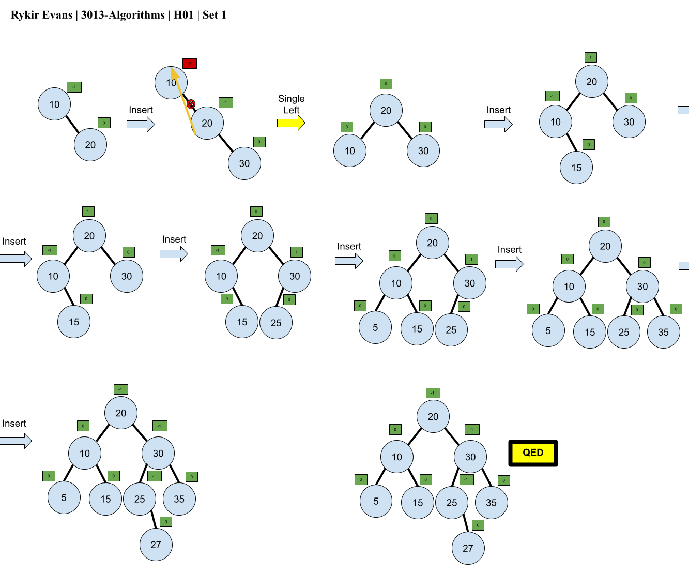
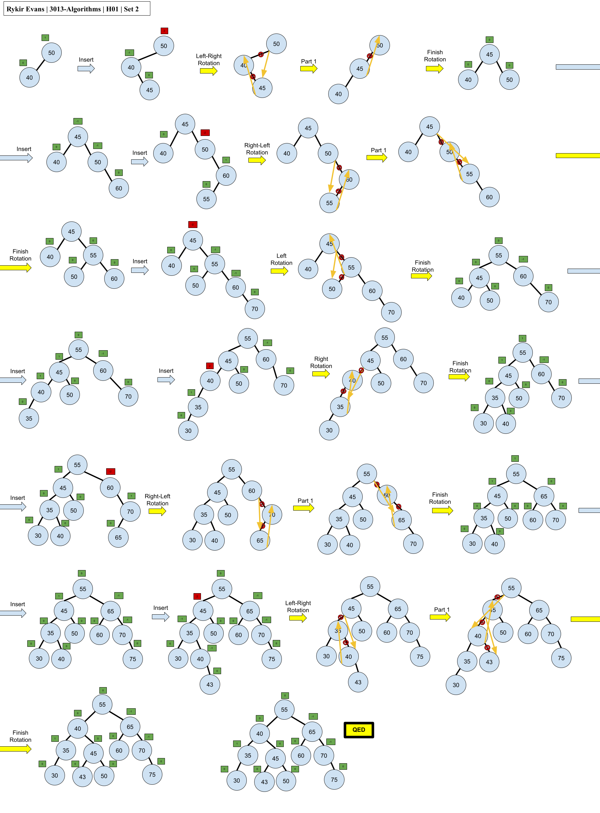
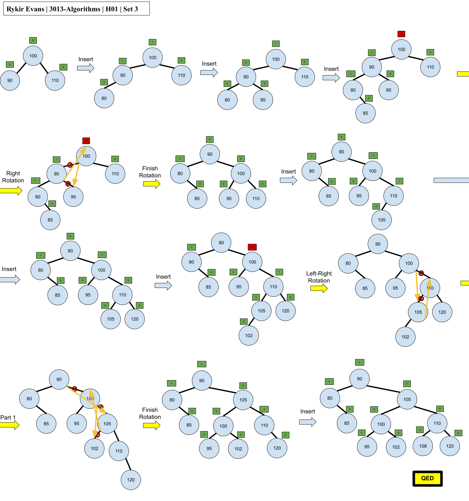
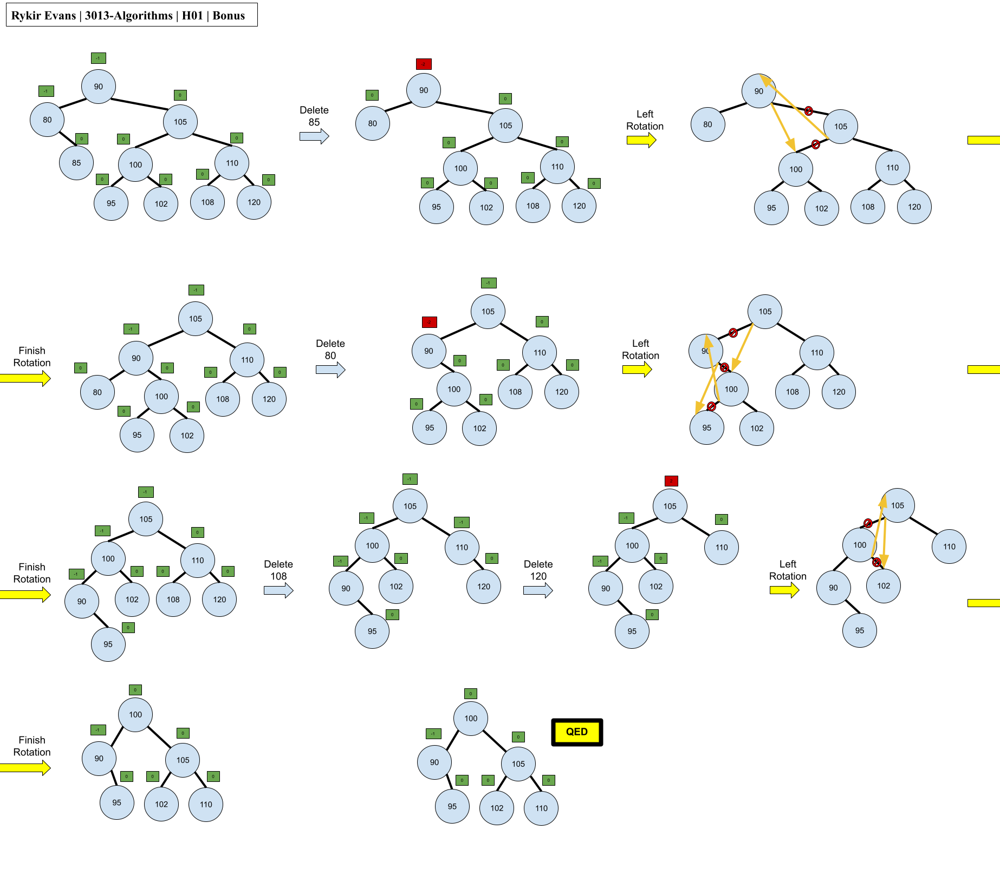

## H01 - AVL Tree Demonstrations
### Rykir Evans
### Description:
This homework assignment is centered around 3 different sets of numbers to be inserted into an AVL Tree. I formulated an AVL tree for each set of numbers and documented the rotations in a graphic.

## Set 1
The following tree makes use of the set of numbers:
```
10, 20, 30, 15, 25, 5, 35, 27
```
Inserting in the above order causes one rotation after inserting `30`, and this is a **left** (single) rotation. The entire tree is constructed as below:



<br>

## Set 2
The following tree makes use of the set of numbers:
```
50, 40, 45, 60, 55, 70, 35, 30, 65, 75, 43
```
Inserting in the above order causes the following rotations:

* **Left-Right** (double) after insterting `45`
* **Right-Left** (double) after inserting `55`
* **Left** (single) after inserting `70`
* **Right** (single) after inserting `30`
* **Right-Left** (double) after inserting `65`
* **Left-Right** (double) after inserting `43`

The entire tree is constructed as below:



<br>

## Set 3
The following tree makes use of the set of numbers:
```
100, 90, 110, 80, 95, 85, 105, 120, 102, 108
```
Inserting in the above order causes the following rotations:

* **Right** (single) after inserting `85`
* **Left-Right** (double) after inserting `102`

The entire tree is constructed as below:



<br>

## Bonus:
For the bonus, we could show what it would look like to delete an element from the AVL Tree. I used the ending tree from `Set 3` and removed several elements for my example. I deleted the following numbers:
```
85, 80, 108, 120
```

Deleting in this order causes imbalance at multiple parts of the tree, and the process of rebalancing is shown below:

* **Left** (single) after deleting `85`
* **Left** (single) after deleting `80`
* **Right** (single) after deleting `120`



## Conlcusion
This concludes the entirety of Homework 1 over AVL Trees, specifically modeling insertions and deletions. 