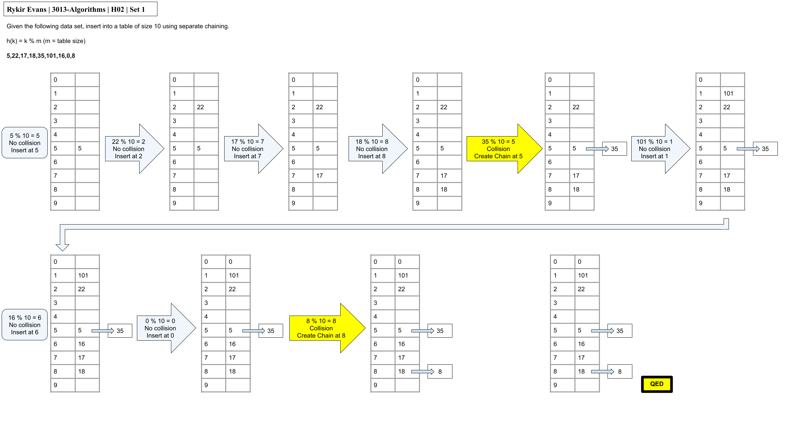
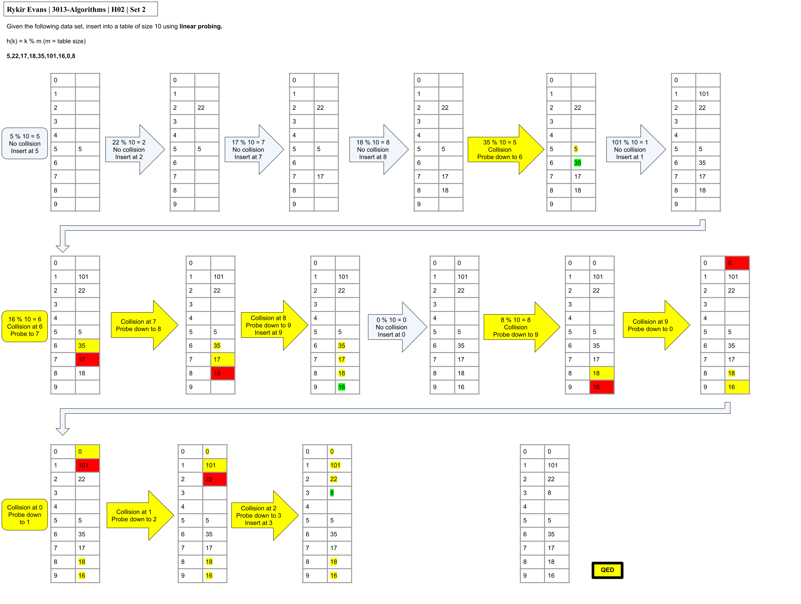
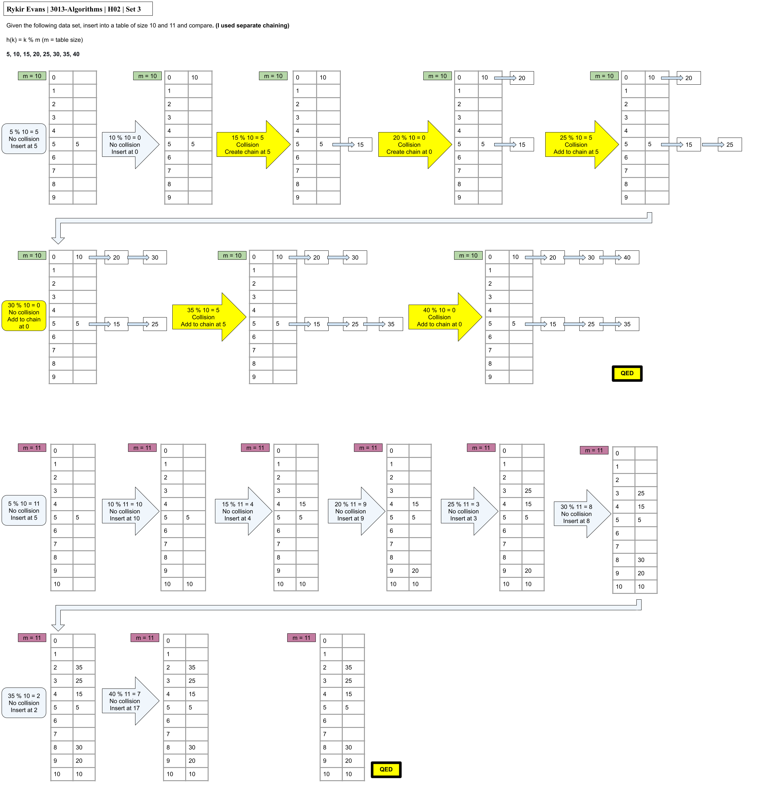

## H02 - Hashing Strategies and Collision Resolution
### Rykir Evans
### Description:

## Conceptual Questions (Part A)
### 1. Define Hashing and Collision Resolution

Hashing involves passing some data through a function to produce a result, called a **hash**. 


A **hash table** is some type of data structure that strives to be a "constant time lookup table". It uses the value of the hash to go directly to the item that is being stored, which the hash is based on.


**Open Addressing** (aka closed hashing) Is a type of collision resolution used which stays entirely within the hash table. If the data is hashed to a certain spot, and that spot is empty, it will go IN the table. Otherwise, some sort of probing sequence is used to identify another valid spot based on the original spot. This sequence repeats until a valid empty spot is found.

**Chaining** (aka open hashing) Is the other type of collision resolution which uses a data structure (typically a linked list) based out of the original spot within the hash table. If there is no list, it will create one. If one exists, the item being inserted into the table goes to the end of the list.

### 2. Collision Resolution Techniques
**Linear Probing** is a probing technique that simply looks at the next spot within the hashing table if the original spot is full. It repeats this sequence until an open spot is found.
* Pros: Simple to implement and understand
* Cons: Could result in primary clustering 

**Quadratic Probing** is another common probing technique that applies a simple quadratic formula to find the next spot. This formula is often resembling `(h(K) + i^2) mod m` which increases the space between examined spots quadratically.
* Pros: Works well for large table sizes
* Cons: Could result in secondary clustering

**Double Hashing** is a probing technique which applies a different hash function to get a new valid position.
* Pros: Minimizes secondary clustering 
* Cons: less intuitive and harder to implement

<br>

**Chaining** is capable of handling more data than table slots since it utilizes a linked list that is only attached to the table via the head, and this list has theoretically unrestricted growth, meaning a table with one slot could handle as much data as needed, it would just be horribly inefficient.

**Worst Case Time Complexity** for each collision resolution technique ends up being **O(n)** due to the possibility that data has the potential to hash to the same spot and attempt the probing sequence from there. This highly increases the odds that a dataset containing elements that will hash to the same first position and each technique can only expand in particular way, meaning all of the data must be searched using the probing technique.

### 3. Impacts of Hash Table Size
**Size** of a table has many defining factors of how a hash table will behave. For example, if the hash function is defined by modding the table size, all even and composite numbers will cause some type of clustering with enough data.

This is best mitigated by choosing a prime number for the size of the table, which will often yield a less common hash value depending on the data set.

Choosing a poor table size can lead to the aforementioned clustering rather soon, for example, if our table size was 10 and our data set was purely even numbers `2, 4, 6, ...` We would get fine placement for the first 5 numbers, but then every single number after that would be a collision.

Additionally, if our table is too small, we have the potential to start clustering much worse even if we chose a prime number for the table size. Conversely, with a table size that is far too big, we might not cluster as badly, but large amounts of space are wasted. This effect tends to be balanced by choosing a table size of around 20% bigger than the data set.

## Simulation and Diagram Exercises (Part B)

### Set 1
* h(k) = k mod m (m = table size)
* Values:
    * `5, 22, 17, 18, 35, 101, 16, 0, 8`
* Table Size: 10
* Collision Resolution: **Separate Chaining**




Inserting the values in order with a table size of 10 and using separate chaining as our colision resolution. We run into relatively few collisions, only two throughout the entire process. Clustering seems minimal at the end, however, with relatively few empty spots left, it's likely we've used most of our luck, and the majority of values added afterwards would begin to chain further.

### Set 2
* h(k) = k mod m (m = table size)
* Values:
    * `5, 22, 17, 18, 35, 101, 16, 0, 8`
* Table Size: 10
* Collision Resolution: **Linear Probing**




With the same values and table size, but instead using **Linear Probing** as our collision resolution, we run into many more issues. After only the second collision, the entire bottom half of the table becomes blocked off, meaning anything with a hash greater than or equal to 5 would have to go all the way down the table and back up again. This is seen with the 3rd and final collision from the data set which tries to go into position 8, but probes 5 times before finding and open spot. Overall, linear probing has a more difficult time with this data set.

### Set 3
* h(k) = k mod m (m = table size)
* Values:
    * `5, 10, 15, 20, 25, 30, 35, 40`
* Table Size: 10 and 11
* Collision Resolution: **Separate Chaining**



This set of numbers was tested using **separate chaining** and two different table sizes. The first size of 10 (denoted with green markers) experiences really bad primary clustering, centering around indecies 0 and 5 because our data set is purely multiples of 5. Since our table size is also a multiple of 5, this causes the really extreme clustering.

The second size of 11 (denoted with purple markers) experiences 0 collisions when storing the data. This is due to the fact that 11 is a prime number, meaning the mod result is less likely to have been used before, and in this case, used 0 times throughout the data set. In fact, 4 more items could have been stored into the table before any collisions occured, and once that threshold was crossed, each collision would be resolved by creating a list for another 11 items and then the pattern would repeat, though this is not indicative of every data set.

## Reflection & Short-Answer Questions (Part C)
### Real World Impact
A poor hash table size, like composite numbers, especially even numbers, can lead to clustering sooner rather than later. Additionally, the size relevant to the dataset can also be important, if our table size is too close to the size of our data set, it becomes rather difficult to hash with ample amount of space in between elements. Alternatively, a table that is too big may have great hash efficiency, but sacrifices available space. This is where the roughly ideal size of 20% larger than the data set comes into play.


Open and closed hashing strategies tend to handle collisions fundamentally different. In a high load scenario, open hashing can suffer from long search times and high overhead, making operations inefficient more quickly. Closed hashing on the other hand tends to handle high-load scenarios with more grace because each list would tend to have less clustering, however, this ideal performance degrades if the "buckets" become arbitrarily long.

### Design Considerations
```
If you were to design a hash table for a high-frequency trading system where every millisecond counts, which collision resolution strategy might you choose and why?
```

I would personally choose closed hashing since following addresses of pointers down a list tends to be quicker and more time efficient than calculating a next probe. If a proper table size was selected, no chain would become too long, meaning performance would stay ideal.

<br>

```
How might you combine the benefits of chaining and open addressing to design a hybrid hash table?
```
Using the original hash table as a one dimensional array, potentially every slot could be linked to its own one dimensional array that could in a sense, act as a secondary hash table. This effectively creates a 2D array which uses closed hashing to link the original hash table to all of the secondary ones, and we could use some probing technique inside of the secondary ones, such as linear probing. In my reasoning, this would create a hybrid hash table.
